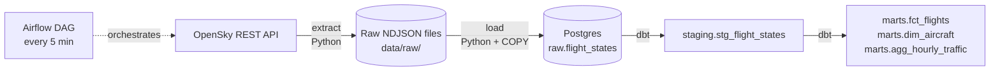

# Flight Tracking Pipeline

An end-to-end data pipeline that collects live aircraft positions from the
[OpenSky Network](https://opensky-network.org/), stores them in Postgres, and
models them with dbt into flights, aircraft and hourly traffic tables.
Airflow runs the whole thing every 5 minutes.



## Stack

| Layer          | Tool                                     |
| -------------- | ---------------------------------------- |
| Extract        | Python, `requests`, `pydantic`           |
| Raw storage    | NDJSON files, partitioned by date        |
| Warehouse      | Postgres 18                              |
| Transform      | dbt-core 1.12 (dbt-postgres)             |
| Orchestration  | Airflow 3.3                              |
| Infrastructure | Docker Compose                           |
| Testing / CI   | pytest, dbt data + unit tests, GitHub Actions |

## Quick start

Requirements: Docker Desktop, [uv](https://docs.astral.sh/uv/), and `make`.

```bash
cp .env.example .env      # optionally add OpenSky credentials (see below)
make up                   # start Postgres + Airflow
```

Open http://localhost:8080. The `flight_tracking` DAG starts on its own and runs
every 5 minutes. To run it straight away: `make trigger`.

Query the results with any Postgres client at `localhost:5432`
(user, password and database are all `flights`):

```sql
select callsign, origin_country, first_seen_at, duration_seconds, max_altitude_m
from marts.fct_flights
order by first_seen_at desc
limit 20;
```

Stop everything with `make down`. Data is kept in Docker volumes between restarts.

### OpenSky credentials

Anonymous access works but allows only about 400 requests a day, which is enough for
the default 5-minute schedule over a small area. For more headroom, create an API
client from your account page on opensky-network.org and put the ID and
secret in `.env`:

```bash
OPENSKY_CLIENT_ID=...
OPENSKY_CLIENT_SECRET=...
```

Then restart: `make up`.

### Changing the tracked area

Set `OPENSKY_BBOX=lamin,lomin,lamax,lomax` in `.env`. The default is Switzerland
(`45.8,5.9,47.8,10.5`). Larger areas cost more OpenSky credits per request: under
25 square degrees costs 1, up to 100 costs 2, up to 400 costs 3, and anything larger costs 4.

## How it works

### 1. Extract (`extract/`)

Calls OpenSky's `/states/all` endpoint and validates every aircraft row with
pydantic. Malformed rows are logged and skipped rather than failing the run.
The client:

- logs in with OAuth2 client credentials when they're set, and refreshes the token before it expires
- retries timeouts and 5xx errors with exponential backoff
- respects OpenSky's rate-limit header, but fails fast when the daily quota is used up instead of blocking for hours

Each snapshot is written atomically to
`data/raw/states/date=YYYY-MM-DD/states_<unix time>.ndjson`.

### 2. Load (`load/`)

Copies new raw files into `raw.flight_states` using Postgres `COPY`.

- Each file loads in its own transaction: its old rows are deleted and it is re-inserted, so reloading never duplicates data.
- `raw.loaded_files` tracks what's been loaded, so each run only processes new or changed files.
- A bad file is logged and retried next run while the others still load.
- An advisory lock stops overlapping runs from double-loading a file.

### 3. Transform (`dbt/`)

| Model                        | Type  | Description |
| ---------------------------- | ----- | ----------- |
| `staging.stg_flight_states`  | view  | Cleaned positions: timestamps converted, callsigns trimmed, position source decoded, duplicates removed. |
| `marts.fct_flights`          | table | One row per flight. OpenSky has no flight IDs, so a flight is inferred: it starts when an aircraft first appears, reappears after more than 20 minutes (`flight_gap_minutes`), or changes callsign. |
| `marts.dim_aircraft`         | table | One row per aircraft with its latest callsign, country, and flight count. |
| `marts.agg_hourly_traffic`   | table | Aircraft counts and average altitude/speed per hour and country. |

Browse the model docs and lineage graph with `make dbt-docs`.

### 4. Orchestrate (`dags/flight_tracking.py`)

`extract >> load >> dbt_build`, every 5 minutes, with one active run at a time.
Extract and load retry twice. dbt doesn't retry, because a failing data test
needs a human to look at it.

## Testing

```bash
make setup     # create .venv and .venv-dbt (first time only)
make up        # the database tests need Postgres
make test      # 164 pytest tests
make dbt-build # 42 dbt checks: models, data tests, and unit tests
```

| What                         | Where |
| ---------------------------- | ----- |
| Config parsing & validation  | `tests/test_config.py` |
| API response parsing         | `tests/test_models.py` |
| HTTP client: auth, retries, rate limits, errors | `tests/test_opensky_client.py` (mocked HTTP, no network) |
| File writing                 | `tests/test_writer.py` |
| Loader, without a database   | `tests/test_loader_unit.py` |
| Loader against real Postgres (idempotency, rollback, concurrency) | `tests/test_loader_db.py` |
| CLI exit codes               | `tests/test_run.py`, `tests/test_load_run.py` |
| DAG structure & task behaviour | `tests/test_dag.py` |
| Raw files → load → dbt → marts | `tests/test_pipeline_end_to_end.py` |
| SQL logic on fixed inputs (flight splitting, dedupe, aggregates) | dbt unit tests in `dbt/models/**/*.yml` |
| Data quality on real data (ranges, uniqueness, relationships) | dbt data tests in `dbt/models/**/*.yml` and `dbt/tests/` |

Database tests use a separate `flights_test` database and are skipped when Postgres
isn't running. CI (`.github/workflows/ci.yml`) runs every test against a Postgres
service and also builds the Docker image.

## Project layout

```
dags/            Airflow DAG
extract/         OpenSky client, models, raw file writer, CLI
load/            Postgres loader and CLI
dbt/             dbt project (models, tests, profiles.yml)
tests/           pytest suite
data/            raw NDJSON files (git-ignored)
Dockerfile       Airflow image with project deps + dbt in its own virtualenv
Makefile         common commands (run `make help`)
```

## Local development

`make setup` creates two virtual environments, because dbt's and Airflow's
dependencies conflict:

- `.venv`: the project, the test tools, and Airflow (for the DAG tests)
- `.venv-dbt`: dbt

Useful commands: `make extract`, `make load`, `make dbt-build`, `make logs`. When
running locally, `WAREHOUSE_URL` in `.env` should point at `localhost`. Inside
Docker the stack overrides it to point at the `warehouse` container.

## Troubleshooting

- **`docker-credential-desktop: executable file not found`**: Docker Desktop's
  helper binaries aren't on your `PATH`. Add them:
  `export PATH="/Applications/Docker.app/Contents/Resources/bin:$PATH"`.
- **`rate limited by OpenSky`** in the extract logs: the daily quota is used up.
  Add credentials, shrink `OPENSKY_BBOX`, or run less often.
- **Port 5432 or 8080 already in use**: stop the other service, or change the
  host-side port in `docker-compose.yml`.

## Limitations and next steps

- The marts are rebuilt in full on every run. That's fine for weeks of data from
  one region, but at larger scale `fct_flights` should become an incremental model.
- Raw files and the raw table grow without limit. A retention job would be the next addition.
- Flights are inferred from gaps in coverage, so an aircraft that leaves the tracked
  area and comes back within 20 minutes counts as one flight.
- The Airflow setup is single-container "standalone" mode with login disabled.
  It's meant for local use, not production.
